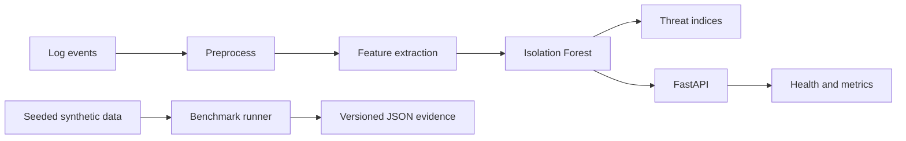

# Cautious Enigma

[](https://github.com/CoreyLeath-code/cautious-enigma/actions/workflows/ci.yml)
[](https://github.com/CoreyLeath-code/cautious-enigma/actions/workflows/supply-chain.yml)


[](LICENSE)

Cautious Enigma is a reproducible anomaly-detection pipeline and observable FastAPI service.
It converts security log events into time, source-frequency, and keyword features, then applies
an Isolation Forest detector. The repository is intentionally explicit about what is measured:
systems benchmarks do not establish predictive model quality.

## Research question

**Can a fixed Isolation Forest configuration produce deterministic anomaly decisions while
providing auditable batch-inference latency and throughput measurements?**

The benchmark uses a seeded synthetic feature generator and records the dataset SHA-256,
parameters, dependency versions, platform, UTC generation time, latency distribution, throughput,
and anomaly count in a versioned JSON document.

## Verifiable metrics

| Evidence | Metric or invariant | Acceptance rule | Verification |
|---|---|---:|---|
| Unit/API suite | Branch coverage | >= 90% | `pytest`; inspect `coverage.xml` |
| Static analysis | Ruff and Bandit findings | 0 blocking findings | `make quality` |
| Dependencies | Known vulnerable runtime packages | 0 audit failures | `pip-audit -r Requirements.txt` |
| Container | Runtime UID | exactly `10001` | CI executes `id -u` inside the image |
| Runtime | Health probe | HTTP 200 within 40 s | CI container smoke test |
| Kubernetes | Schema errors | 0 in strict mode | Kubeconform CI step |
| Supply chain | HIGH/CRITICAL actionable findings | 0 | Trivy repository and image scans |
| Benchmark | Median/p95 latency and rows/s | measured, not gated | CI `benchmark.json` artifact |
| Reproducibility | Dataset hash and anomaly count | identical for same seed/config | `tests/test_benchmark.py` |

The latest numerical performance measurements are attached to each successful CI run as
`benchmark-and-coverage/artifacts/benchmark.json`. This avoids presenting a stale result as a
universal claim. GitHub records the runner image and commit alongside the artifact.

## Benchmark protocol

The CI protocol is 1,000 rows, one warm-up, five timed iterations, seed 42, 100 trees, and
contamination 0.1. Local research runs default to 10,000 rows, three warm-ups, and 20 timed
iterations.

```bash
python -m venv .venv
# Linux/macOS: source .venv/bin/activate
# Windows PowerShell: .venv\Scripts\Activate.ps1
python -m pip install -r requirements-dev.txt
python benchmarks/run_benchmark.py --output artifacts/benchmark.json
pytest
```

A valid result contains:

- `schema_version` and the complete benchmark parameter set;
- median and p95 batch latency in milliseconds;
- median-derived rows per second and last-iteration anomaly count;
- Python, NumPy, pandas, scikit-learn, OS/platform, UTC time, and dataset SHA-256.

Latency is expected to vary by CPU load, runner generation, operating system, and power policy.
Compare performance only when the parameter block and environment metadata are compatible.
The synthetic benchmark tests computational behavior, not real-world recall, fairness, drift,
or threat-detection efficacy. Predictive accuracy requires a versioned, labeled evaluation set
that this repository does not currently include.

## API

```bash
uvicorn app.api:app --host 127.0.0.1 --port 8000
curl http://127.0.0.1:8000/health
curl http://127.0.0.1:8000/metrics
curl -X POST http://127.0.0.1:8000/predict \
  -H "x-api-key: $CAUTIOUS_API_KEY" \
  -H "content-type: application/json" \
  -d '{"data":{"hour":12,"ip_freq":3,"suspicious_flag":1}}'
```

Set `CAUTIOUS_API_KEY` in production; prediction routes then require the `x-api-key` header.
`/batch_predict` accepts at most 1,000 inline records and never accepts server filesystem paths.
The prediction endpoint requires a trained `baseline_classifier` in the model registry. Registry
artifacts are SHA-256 verified before deserialization. Missing models return a sanitized HTTP 503;
invalid features return HTTP 422. Prometheus telemetry exposes bounded-cardinality request counts
and latency histograms at `/metrics`.

## Architecture



| Path | Responsibility |
|---|---|
| `data_loader.py`, `feature_engineering.py` | Baseline log-to-feature pipeline |
| `model.py`, `detector.py` | Deterministic training and anomaly decisions |
| `app/` | Validated API, probes, and Prometheus telemetry |
| `src/` | Configurable training and inference components |
| `benchmarks/` | Reproducible research benchmark |
| `tests/` | Behavior, API contract, and provenance verification |
| `.github/workflows/` | Quality, benchmark, deployment, and supply-chain evidence |

Operational decisions, residual risks, and production readiness are recorded in
[the audit](docs/AUDIT.md), [deployment runbook](docs/DEPLOYMENT.md), and
[production checklist](docs/PRODUCTION_CHECKLIST.md).

## Deployment hygiene

Nine promotion controls cover source integrity, repeatable builds, automated verification,
artifact integrity, configuration safety, runtime hardening, observability, safe promotion, and
signed releases. The detailed control/evidence matrix, rollback procedure, and time-bounded
exception policy are in [docs/ENGINEERING_QUALITY.md](docs/ENGINEERING_QUALITY.md).

```bash
docker compose up --build
docker build -t cautious-enigma:local .
kubectl apply -f network-policy.yaml -f deployment.yaml -f service.yaml
```

The Kubernetes example uses a non-root read-only container, dropped capabilities, RuntimeDefault
seccomp, disabled service-account token mounting, resource bounds, three probe types, a rolling
strategy, an immutable version tag, and default-deny networking. Supply Chain CI scans source and
image, emits an SPDX SBOM, publishes semantic-tag images to GHCR, and signs them keylessly.

## Responsible use

Isolation Forest outputs are review signals, not proof of malicious activity. Keep a human in the
decision loop, protect log data, monitor false positives and drift, and validate against a
representative labeled dataset before operational enforcement.

## License

MIT. See [LICENSE](LICENSE).
